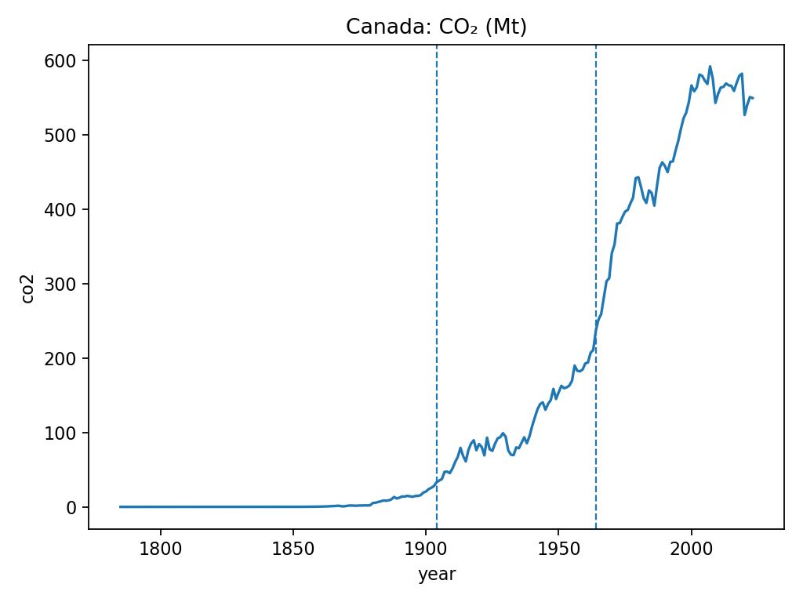
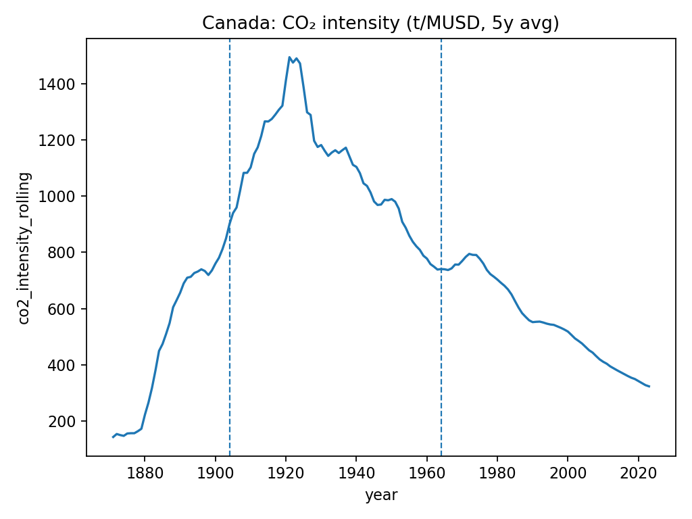

# AI Environmental Report Bot – 🇨🇦 Canada MVP

An automated **Generative AI-powered environmental summarizer** that analyzes and reports on **Canada’s CO₂ emissions trends** using open data from **Our World in Data (OWID)**.

---

## Overview

This project automatically:
1. **Fetches** real environmental data (CO₂, GDP, population) from open datasets.  
2. **Analyzes** long-term trends and detects major **changepoints** in emissions patterns.  
3. **Visualizes** results in clear charts.  
4. **Generates natural-language reports** (Markdown or PDF) summarizing environmental shifts - optionally enhanced by an LLM (e.g., OpenAI GPT-4o).

All reports are reproducible, data-driven, and suitable for weekly or monthly publication.

---

## 🇨🇦 Latest Canada Weekly Environmental Briefing – 2025-10-28

**📄 Full report:** [View Markdown report →](outputs/reports/canada_weekly_briefing_2025-10-28.md)

---

### Highlights
| Metric | Value | YoY Change |
|:--------|:------|:-----------|
| **Total CO₂** | 549.3 Mt | −0.24 % |
| **CO₂ per capita** | 13.98 t/person | −1.45 % |
| **CO₂ intensity (5 y avg)** | 323.75 t/MUSD | — |

- **Notable changepoints:** 1904 and 1964  
- **Trend:** Overall emissions decreasing in recent years  
- **Observation:** Reflects industrialization and later efficiency gains  
- **Data smoothing:** 5-year rolling averages applied for stability  

---

### Visualizations
| Metric | Chart |
|:-------|:------|
| **Total CO₂ (Mt)** |  |
| **CO₂ per capita (t/person)** |  |
| **CO₂ intensity (t/MUSD)** |  |

*Data: [Our World in Data – CO₂ dataset](https://github.com/owid/co2-data).*

---

## Quickstart

```bash
# Clone the repo
git clone https://github.com/<your-username>/ai-environmental-report-bot.git
cd ai-environmental-report-bot

# Create and activate virtual environment
python -m venv .venv && source .venv/bin/activate

# Install dependencies
pip install -e .

# Run full pipeline (fetch → analyze → visualize → summarize)
envbot all
