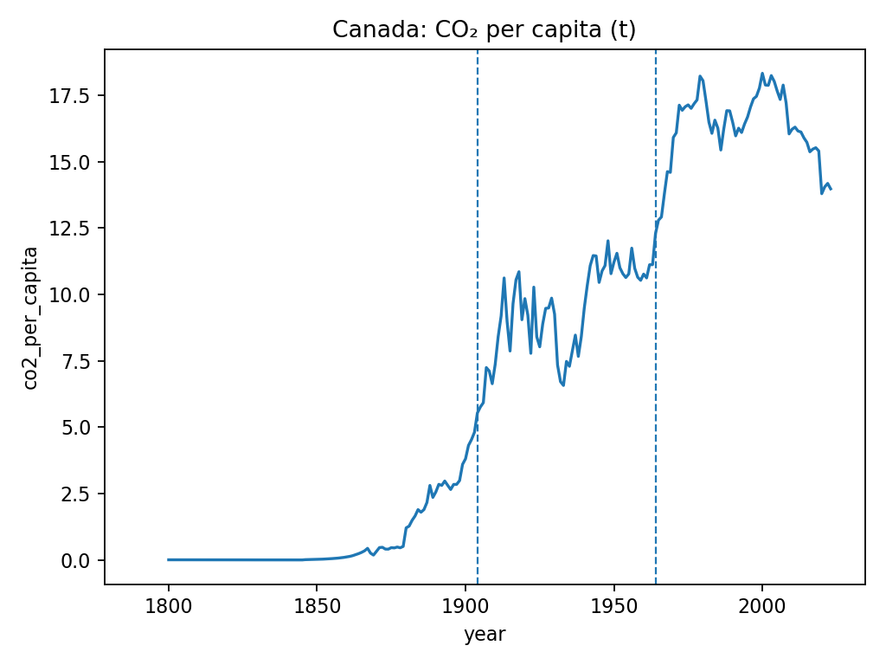

# AI Environmental Report Bot – 🇨🇦 Canada MVP

An automated **Generative AI-powered environmental summarizer** that analyzes and reports on **Canada’s CO₂ emissions trends** using open data from **Our World in Data (OWID)**.

---

## Overview

This project automatically:
1. **Fetches** real environmental data (CO₂, GDP, population) from open datasets.  
2. **Analyzes** long-term trends and detects major **changepoints** in emissions patterns.  
3. **Visualizes** results in clear charts.  
4. **Generates natural-language reports** (Markdown or PDF) summarizing environmental shifts - optionally enhanced by an LLM (e.g., OpenAI GPT-4o).

All reports are reproducible, data-driven, and suitable for weekly or monthly publication.

---

## 🇨🇦 Latest Canada Weekly Environmental Briefing – 2025-10-28

**📄 Full report:** [View Markdown report →](outputs/reports/canada_weekly_briefing_2025-10-28.md)

---

### Highlights
| Metric | Value | YoY Change |
|:--------|:------|:-----------|
| **Total CO₂** | 549.3 Mt | −0.24 % |
| **CO₂ per capita** | 13.98 t/person | −1.45 % |
| **CO₂ intensity (5 y avg)** | 323.75 t/MUSD | — |

- **Notable changepoints:** 1904 and 1964  
- **Trend:** Overall emissions decreasing in recent years  
- **Observation:** Reflects industrialization and later efficiency gains  
- **Data smoothing:** 5-year rolling averages applied for stability  

---

### Visualizations
| Metric | Chart |
|:-------|:------|
| **Total CO₂ (Mt)** |  |
| **CO₂ per capita (t/person)** |  |
| **CO₂ intensity (t/MUSD)** |  |

*Data: [Our World in Data – CO₂ dataset](https://github.com/owid/co2-data).*

---

## Quickstart

# Clone the repo
git clone https://github.com/<your-username>/ai-environmental-report-bot.git
cd ai-environmental-report-bot

# Create and activate virtual environment
python -m venv .venv && source .venv/bin/activate

# Install dependencies
pip install -e .

# Run full pipeline (fetch → analyze → visualize → summarize)
envbot all

---

## Data Sources & Attribution

- **Primary dataset:** Our World in Data — *CO₂ and Greenhouse Gas Emissions*  
  Repository: https://github.com/owid/co2-data  
  File used: `owid-co2-data.csv` (fetched from OWID’s GitHub)

- **Key fields used:** `country`, `year`, `co2`, `co2_per_capita`, `gdp`, `population`,
  `primary_energy_consumption`, `energy_per_capita`

- **Refresh cadence:** Pulled on each pipeline run (weekly via GitHub Actions, or manual run).

> *Note:* Charts and summaries generated by this repository reflect OWID’s dataset at the time of the run.

---

## Architecture & Pseudocode

**Goal:** Fetch → Analyze → Detect changepoints → Visualize → Summarize → (optional) Publish.

**Pseudocode**
1. **Fetch**
   - Download `owid-co2-data.csv` from OWID GitHub.
   - Filter rows for `country == "Canada"`.
   - Save to `data/processed/canada_co2_<date>.csv`.

2. **Analyze**
   - Compute features:
     - `co2_yoy_pct = pct_change(co2)`
     - `co2_pc_rolling = rolling_mean(co2_per_capita, window=5)`
     - `co2_intensity_t_per_musd = (co2 * 1e6) / (gdp / 1e6)` (guard divide-by-zero)
     - `co2_intensity_rolling = rolling_mean(co2_intensity_t_per_musd, window=5)`
   - Detect changepoints on `co2_per_capita` using PELT (ruptures, model="rbf").
   - Map detected indices back to original years (handle NaNs).
   - Write `canada_co2_analyzed_<date>.csv`.

3. **Visualize** (Matplotlib; single-plot per figure)
   - `outputs/charts/co2_total.png` — `year` vs `co2`
   - `outputs/charts/co2_per_capita.png` — `year` vs `co2_per_capita`
   - `outputs/charts/co2_intensity.png` — `year` vs `co2_intensity_rolling`
   - Mark vertical lines at detected changepoints.

4. **Summarize**
   - Compute latest-year metrics + YoY deltas.
   - Heuristic narrative; if `OPENAI_API_KEY` present, request LLM-enhanced summary.
   - Render Markdown via Jinja2 → `outputs/reports/canada_weekly_briefing_<date>.md`.

5. **Automate (optional)**
   - GitHub Actions weekly cron:
     - Run pipeline.
     - Commit latest `outputs/`.
     - Publish `outputs` to GitHub Pages (static site).
---
