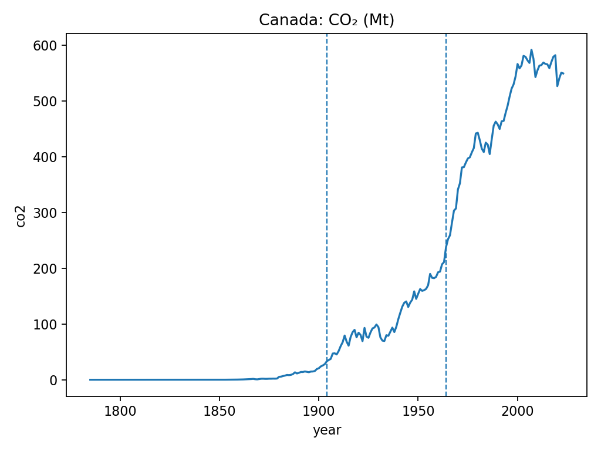
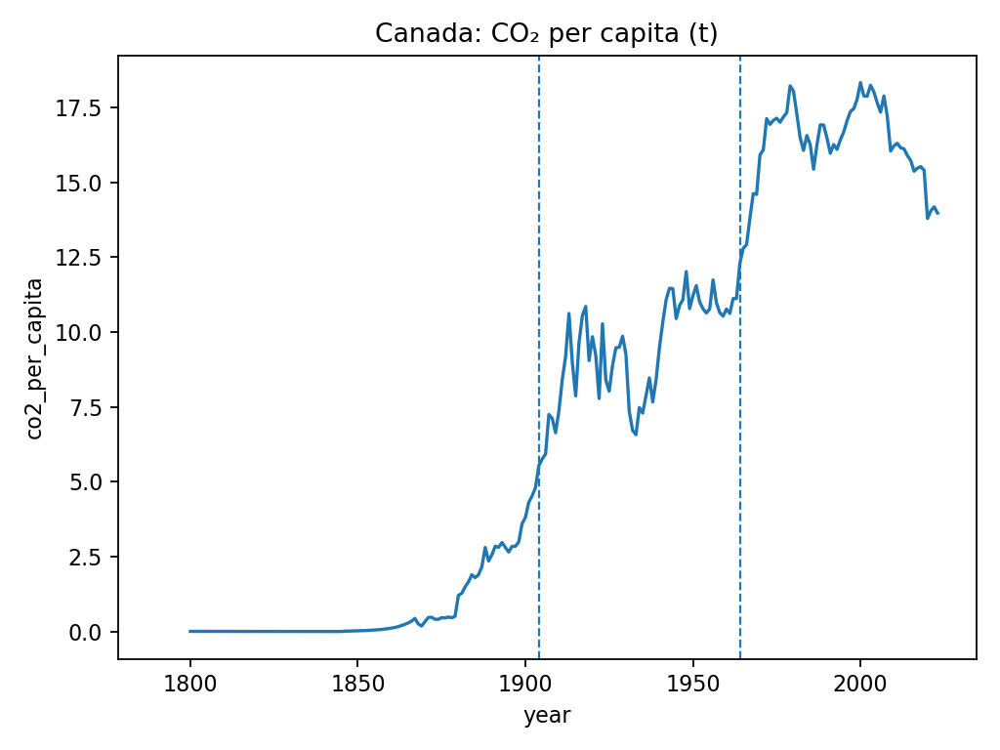
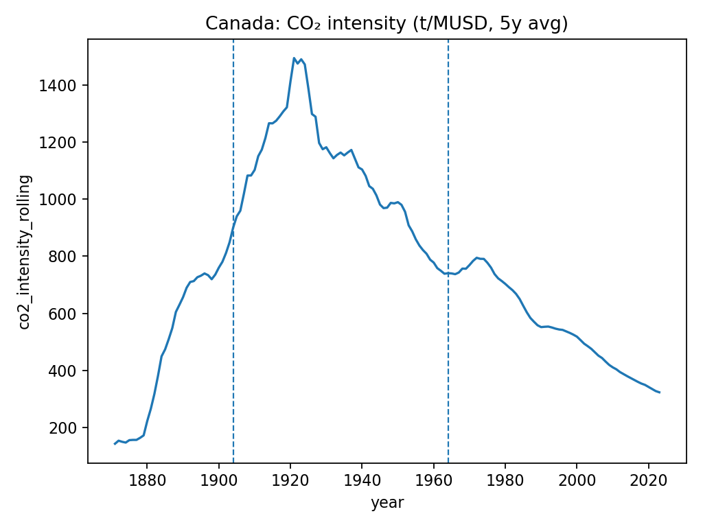

# 🇨🇦 Canada Weekly Environmental Briefing – 2025-10-28

**Scope:** CO₂ trends from OWID dataset. Figures auto-generated.

## Highlights
- Latest year: **2023**.
- Total CO₂: **549.3 Mt** (YoY: -0.24%).
- CO₂ per capita: **13.98 t/person** (YoY: -1.45%).
- CO₂ intensity (5y avg): **323.75 t/MUSD**.

## Notable changes
- Changepoints detected around: **1904, 1964**.

## Narrative summary
CO₂ totals are decreasing in the latest year.
Multiple changepoints were detected.
Per-capita emissions include a 5-year smoothing for stability.

## Figures

*Data: Our World in Data (owid-co2-data.csv). Generated 2025-10-28.*